# Architecture Design: SpriteShift AI

## 1. Architectural Overview

SpriteShift AI is designed as a distributed, cloud-native system based on a **microservices architecture**. This approach promotes scalability, maintainability, and resilience. Each service is independently deployable and focuses on a single business capability.

The system is asynchronous and event-driven, with a central **Job Queue** managing the flow of tasks between services. This ensures that the platform can handle fluctuating loads and that long-running AI processes do not block user-facing services.

## 2. Architecture Diagram

The following diagram illustrates the high-level architecture of the SpriteShift AI platform.

```mermaid
graph TD
    subgraph "User Interaction"
        User(👤 User)
        Frontend[🌐 Web Frontend]
    end

    subgraph "Core Backend"
        APIGateway[API Gateway]
        Auth[🔒 Auth Service]
        Billing[💳 Billing Service]
        Orchestrator[⚙️ Orchestrator Service]
    end

    subgraph "Asynchronous Workers"
        JobQueue[(📊 Job Queue)]
        Inference[🧠 Inference Service]
        MediaPipeline[🖼️ Media Pipeline Service]
        Moderation[🛡️ Moderation Service]
    end

    subgraph "Data & Storage"
        ObjectStore[(🗄️ Object Storage S3)]
        CDN[(⚡️ CDN)]
        Database[(📄 Database)]
    end

    subgraph "External / AI Models"
        HF[🤗 Hugging Face API]
        LocalGPU[💻 Local GPU Models]
        PaymentGateway[💵 Payment Gateway]
    end

    User --> Frontend
    Frontend --> APIGateway

    APIGateway --> Auth
    APIGateway --> Billing
    APIGateway --> Orchestrator

    Orchestrator --> JobQueue
    Orchestrator --> Database
    Orchestrator --> ObjectStore

    JobQueue --> Inference
    JobQueue --> MediaPipeline
    JobQueue --> Moderation

    Inference --> LocalGPU
    Inference --> HF
    Inference --> ObjectStore

    MediaPipeline --> ObjectStore
    Moderation --> ObjectStore

    ObjectStore --> CDN
    CDN --> Frontend

    Auth --> Database
    Billing --> PaymentGateway
    Billing --> Database
```

## 3. Component Descriptions

### Core Services

-   **Web Frontend:** A single-page application (SPA) that provides the user interface for uploading images, managing projects, and viewing results.
-   **API Gateway:** The single entry point for all client requests. It handles request routing, rate limiting, and forwards requests to the appropriate downstream service.
-   **Auth Service:** Manages user authentication and authorization. Responsible for user registration, login, and issuing JSON Web Tokens (JWTs) to authenticate API requests.
-   **Billing Service:** Handles all payment-related logic. It integrates with a third-party payment provider (e.g., Stripe) to manage user subscriptions, process payments, and control access to tiered features.
-   **Orchestrator Service:** The central controller of the AI workflow. It receives job requests from the user, validates them, and breaks them down into a series of tasks. It then publishes these tasks to the Job Queue and monitors their progress.

### Asynchronous Workers & Queue

-   **Job Queue (e.g., RabbitMQ, Redis):** A message broker that decouples the core services from the worker services. It queues tasks for background processing, allowing for retries and prioritization (e.g., Pro users' jobs are processed first).
-   **Inference Service:** A worker that consumes tasks from the queue related to AI model execution. It runs models like `rembg`, `AnimateDiff`, and `MediaPipe` on dedicated hardware (local GPUs) or via external APIs (Hugging Face Inference).
-   **Media Pipeline Service:** A worker that handles non-AI media processing tasks, such as resizing images, applying style harmonization, packing sprite sheets, and generating the final JSON metadata.
-   **Moderation Service:** A worker that performs safety checks on user-uploaded content. It uses automated image scanning tools to flag potentially inappropriate images for a human review queue.

### Data & Storage

-   **Database (e.g., PostgreSQL):** The primary database for storing user data, project metadata, job status, and subscription information.
-   **Object Storage (e.g., AWS S3, MinIO):** A scalable storage solution for all binary data, including original user uploads, intermediate files, and final generated assets (sprite sheets, videos).
-   **Content Delivery Network (CDN) (e.g., Cloudflare, AWS CloudFront):** Caches the final assets at edge locations around the world, ensuring fast delivery to users.

### External Dependencies

-   **Hugging Face API / Local GPU Models:** The Inference Service relies on these to execute the AI models. The system is designed to use local GPU resources first and fall back to cloud-based inference APIs if needed.
-   **Payment Gateway (e.g., Stripe):** The Billing Service integrates with a payment gateway to handle secure payment processing.
